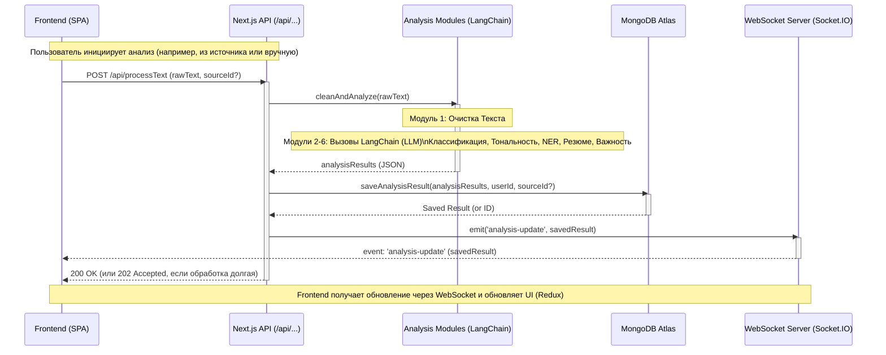

---

## Документация: Backend Приложения

**Файл:** `docs/backend.md`

**1. Обзор Архитектуры Backend**

Backend приложения построен с использованием **Next.js API Routes**, работающих на **Node.js**. Он выступает в роли API-сервера для нашего SPA Frontend (React), а также выполняет задачи по обработке данных, интеграции с ИИ (LangChain), взаимодействию с базой данных (MongoDB) и управлению WebSocket-соединениями для обновлений в реальном времени.

Выбранная архитектура для MVP — **монолитный Backend на Next.js** — позволяет упростить разработку и деплой на начальном этапе, объединяя API и логику обработки в одном проекте.

**2. Технологический Стек Backend**

*   **Среда выполнения:** Node.js (v18+)
*   **Фреймворк:** Next.js (v14+) - используется для API Routes
*   **Язык:** TypeScript
*   **База данных:** MongoDB Atlas
*   **ODM (Object Data Modeling):** Mongoose (для работы с MongoDB)
*   **ИИ/NLP:** LangChain.js (для оркестрации LLM)
*   **LLM:** OpenAI API (gpt-3.5-turbo для MVP)
*   **Real-time:** Socket.IO (для WebSocket)
*   **Аутентификация:** JWT (jsonwebtoken), bcrypt (для хеширования паролей)
*   **Валидация (Опционально):** Zod, class-validator

**3. Структура Проекта (Backend Часть)**

```
.
├── pages/
│   └── api/                  # API Routes Next.js
│       ├── auth/             # Эндпоинты для аутентификации
│       │   ├── login.ts
│       │   └── register.ts
│       ├── sources/          # CRUD для источников
│       │   ├── index.ts      # (GET, POST)
│       │   └── [sourceId].ts # (PUT, DELETE)
│       ├── posts/            # Эндпоинты для постов
│       │   ├── index.ts      # (GET /api/posts?sourceId=...)
│       │   └── [postId]/
│       │       └── raw.ts    # (GET /api/posts/:postId/raw)
│       ├── folders/          # CRUD для папок и агрегированные посты
│       │   ├── index.ts      # (GET, POST)
│       │   └── [folderId]/
│       │       ├── index.ts  # (PUT, DELETE /api/folders/:folderId)
│       │       └── posts.ts  # (GET /api/folders/:folderId/posts)
│       ├── dashboard/        # Эндпоинт для данных дашборда
│       │   └── index.ts      # (GET /api/dashboard)
│       ├── admin/            # Эндпоинты для администрирования
│       │   └── analysis-modules/
│       │       ├── index.ts      # (GET /api/admin/analysis-modules)
│       │       └── [moduleId].ts # (PUT /api/admin/analysis-modules/:moduleId)
│       └── socket.ts         # Настройка Socket.IO сервера (если используется этот подход)
├── lib/
│   ├── mongoose.ts           # Логика подключения к MongoDB
│   ├── langchain.ts          # Инициализация LangChain, LLM
│   ├── auth.ts               # Утилиты для JWT, хеширования
│   └── middleware/           # Middleware для проверки JWT, ролей (если нужно)
├── models/                   # Mongoose схемы (User, Source, AnalysisResult, Folder, ModuleConfig)
│   ├── User.ts
│   ├── Source.ts
│   ├── AnalysisResult.ts
│   ├── Folder.ts
│   └── ModuleConfig.ts       # (если конфигурация хранится в БД)
├── modules/                  # Логика модулей анализа
│   ├── textPreprocessing.ts
│   ├── textClassification.ts
│   ├── sentimentAnalysis.ts
│   ├── ner.ts
│   ├── summarization.ts
│   ├── importanceScoring.ts
│   └── patternAnalysis.ts    # (MVP - базовый)
├── .env.local                # Переменные окружения (DB URI, JWT Secret, OpenAI Key)
└── ...                       # Другие файлы Next.js (next.config.js, tsconfig.json)

```

**4. Основные Обязанности Backend**

*   **Обработка API Запросов:** Предоставление RESTful API для взаимодействия с Frontend (CRUD операции, запуск анализа, получение данных).
*   **Аутентификация и Авторизация:** Регистрация, вход пользователей, генерация/проверка JWT, проверка прав доступа к ресурсам (`userId`, роли).
*   **Взаимодействие с Базой Данных:** Сохранение и извлечение данных пользователя, источников, результатов анализа, папок, конфигураций из MongoDB с использованием Mongoose.
*   **Оркестрация Анализа Текста:**
    *   Прием сырого текста.
    *   Вызов модулей предобработки.
    *   Использование LangChain для вызова LLM и выполнения различных видов анализа (классификация, тональность, NER, резюмирование, оценка важности).
    *   Сохранение результатов анализа в БД.
*   **Real-time Коммуникация:** Управление WebSocket соединениями через Socket.IO для отправки уведомлений Frontend об окончании анализа или других событиях.
*   **Управление Конфигурацией:** Предоставление API для просмотра и изменения конфигурации модулей анализа (для администраторов).

**5. API Дизайн (Сводка)**

*   **Философия:** REST API для большинства операций (запрос-ответ). WebSocket для асинхронных обновлений от сервера к клиенту.
*   **Аутентификация:** Большинство эндпоинтов требуют валидный JWT в заголовке `Authorization: Bearer <token>`.
*   **Эндпоинты:**
    *   **Auth (`/api/auth/`):**
        *   `POST /login`: Вход пользователя, возврат JWT.
        *   `POST /register`: Регистрация пользователя.
        *   *(Опционально)* `GET /me`: Получение данных текущего пользователя.
    *   **Sources (`/api/sources/`):**
        *   `GET /`: Получить список источников пользователя.
        *   `POST /`: Создать новый источник.
        *   `PUT /:sourceId`: Обновить источник.
        *   `DELETE /:sourceId`: Удалить источник.
    *   **Posts (`/api/posts/`):**
        *   `GET /?sourceId=...`: Получить список постов (превью) для источника (с пагинацией).
        *   `GET /:postId/raw`: Получить сырой текст поста.
    *   **Folders (`/api/folders/`):**
        *   `GET /`: Получить список папок пользователя.
        *   `POST /`: Создать папку.
        *   `PUT /:folderId`: Обновить папку.
        *   `DELETE /:folderId`: Удалить папку.
        *   `GET /:folderId/posts`: Получить агрегированные/дедуплицированные посты для папки (с фильтрами и пагинацией).
    *   **Dashboard (`/api/dashboard/`):**
        *   `GET /?startDate=...&endDate=...&folderId=...`: Получить все агрегированные данные для основного дашборда.
    *   **Admin (`/api/admin/`):** (Требует роли администратора)
        *   `GET /analysis-modules`: Получить конфигурацию всех модулей.
        *   `PUT /analysis-modules/:moduleId`: Обновить конфигурацию модуля.
    *   **WebSocket (`/api/socket` или отдельный сервер):**
        *   Событие `connection`: Установка соединения.
        *   Событие `disconnect`: Разрыв соединения.
        *   Сервер -> Клиент: `emit('analysis-update', data)`: Отправка результатов анализа.

**6. Поток Обработки Текста (MVP)**


*Важное замечание для MVP:* На этапе MVP обработка `cleanAndAnalyze` может происходить синхронно внутри запроса `/api/processText`. Запросы к LLM могут быть долгими. Если время ответа API становится неприемлемым, следующим шагом будет внедрение очередей (RabbitMQ/BullMQ) для асинхронной обработки, как было показано на одной из твоих диаграмм. В этом случае API будет возвращать `202 Accepted`, а результат придет только через WebSocket.

**7. Взаимодействие с Базой Данных (MongoDB + Mongoose)**

*   **Подключение:** Устанавливается через `lib/mongoose.ts` с использованием строки подключения из `.env.local`.
*   **Модели:** Определены в `models/` (User, Source, AnalysisResult, Folder, ModuleConfig). Модели описывают структуру документов в коллекциях и предоставляют методы для CRUD операций.
*   **Запросы:** Выполняются через методы Mongoose (например, `User.findOne()`, `AnalysisResult.create()`, `Folder.find()`).
*   **Привязка к пользователю:** **Ключевой аспект.** Все основные коллекции (`Sources`, `AnalysisResults`, `Folders`) должны иметь поле `userId`. **Любой запрос на чтение или запись данных должен включать проверку `userId`**, чтобы гарантировать, что пользователь работает только со своими данными. Эта проверка выполняется в логике API-эндпоинтов перед обращением к Mongoose.
*   **Агрегации:** Для дашбордов и страницы содержимого папки активно используются сложные агрегационные запросы MongoDB (через `Model.aggregate([...pipeline])`) для группировки, подсчета и фильтрации данных на стороне базы данных.

**8. Интеграция LangChain**

*   **Инициализация:** Модели LangChain (например, `ChatOpenAI`) инициализируются в `lib/langchain.ts` или непосредственно в модулях анализа, используя API-ключ из переменных окружения.
*   **Использование в Модулях:** Каждый модуль анализа (`modules/*.ts`) инкапсулирует логику работы с LangChain для своей задачи: создает `PromptTemplate`, `LLMChain` и выполняет вызов `chain.run()` или `chain.call()`.
*   **Асинхронность:** Все вызовы к LLM через LangChain являются асинхронными (`async/await`), чтобы не блокировать основной поток Node.js.
*   **Конфигурация:** Модули анализа должны считывать свою конфигурацию (включен ли модуль, какой промпт использовать) перед выполнением. Для MVP конфигурация может быть захардкожена, но лучше сразу предусмотреть чтение из БД или конфиг-файлов, если реализована страница `AnalysisModulesConfigPage`.

**9. Реализация WebSocket (Socket.IO)**

*   **Настройка Сервера:** Может быть реализована:
    *   **Через Next.js API Route (`/api/socket`)**: Простой способ для MVP, но может иметь ограничения при масштабировании. Сервер Socket.IO инициализируется при первом запросе к этому роуту.
    *   **Через Custom Next.js Server**: Более гибкий подход, позволяющий лучше контролировать жизненный цикл WebSocket сервера. Требует создания `server.js` вместо запуска через `next dev`/`next start`. (Рекомендуется для более сложных приложений).
*   **Инициализация:** Сервер Socket.IO создается и слушает события `connection` и `disconnect`.
*   **Отправка Событий:** После успешного анализа и сохранения результатов в БД, Backend вызывает `io.emit('analysis-update', result)` для отправки данных **всем** подключенным клиентам (или `socket.to(userId).emit(...)` для отправки конкретному пользователю, если настроены комнаты по `userId`).
*   **Подключение Клиента:** Frontend подключается к WebSocket серверу при инициализации приложения (после входа пользователя) и слушает событие `analysis-update` для обновления Redux store.

**10. Аутентификация и Авторизация (Backend)**

*   **Login (`/api/auth/login`):** Проверяет email/пароль (сравнивает хеши `bcrypt`), генерирует JWT с `userId` и `exp`, возвращает токен клиенту.
*   **Register (`/api/auth/register`):** Проверяет email, хеширует пароль (`bcrypt`), создает пользователя в БД.
*   **Middleware (Защита Эндпоинтов):** Создается middleware (например, в `lib/middleware/auth.ts`), которое применяется ко всем защищенным API-роутам. Оно:
    *   Извлекает JWT из заголовка `Authorization`.
    *   Верифицирует токен (проверка подписи и срока действия с использованием `jsonwebtoken.verify()` и секретного ключа).
    *   Извлекает `userId` из payload токена.
    *   Добавляет `userId` (и, возможно, данные пользователя) в объект запроса (`req.user`), чтобы он был доступен в обработчиках API.
    *   Если токен невалиден, возвращает ошибку 401 Unauthorized.
*   **Авторизация (Проверка Прав):** В обработчиках API выполняется дополнительная проверка:
    *   При доступе к ресурсам (источники, папки, результаты): Сравнивается `req.user.id` с `resource.userId`.
    *   При доступе к административным эндпоинтам (`/api/admin/*`): Проверяется роль пользователя (`req.user.role === 'admin'`).

**11. Обработка Ошибок**

*   Использовать стандартные HTTP статусы ошибок (400, 401, 403, 404, 500).
*   Возвращать JSON с полем `error` для описания ошибки на клиенте.
*   Логгировать ошибки на сервере для отладки (использовать `console.error` или более продвинутые системы логгирования).

**12. Деплой и Окружение**

*   **Переменные Окружения:** Все чувствительные данные (MongoDB URI, JWT Secret, OpenAI API Key) должны храниться в переменных окружения (`.env.local` для разработки, настройки платформы деплоя для production).
*   **Сборка:** Для production используется `npm run build`.
*   **Платформы:** Vercel (идеально для Next.js), Render, Heroku, AWS (EC2/ECS/Lambda), Google Cloud (Cloud Run/App Engine).
*   **Docker (Опционально):** Можно контейнеризировать Next.js приложение для более гибкого деплоя.

**13. Масштабируемость и Будущее (Post-MVP)**

*   **Очереди Задач (RabbitMQ/BullMQ):** Вынести долгие задачи анализа текста из API-запроса в фоновые воркеры для улучшения времени ответа API и надежности обработки.
*   **Кэширование (Redis):** Кэшировать результаты анализа, конфигурации модулей, данные дашбордов для снижения нагрузки на БД и LLM API.
*   **Выделенные Воркеры:** Запускать модули анализа (особенно LangChain) в отдельных процессах/сервисах для лучшего масштабирования и управления ресурсами.
*   **Оптимизация БД:** Индексация полей (`userId`, `sourceId`, `publicationDate`) в MongoDB для ускорения запросов.
*   **Горизонтальное Масштабирование:** Запуск нескольких экземпляров Backend приложения за балансировщиком нагрузки.

---

